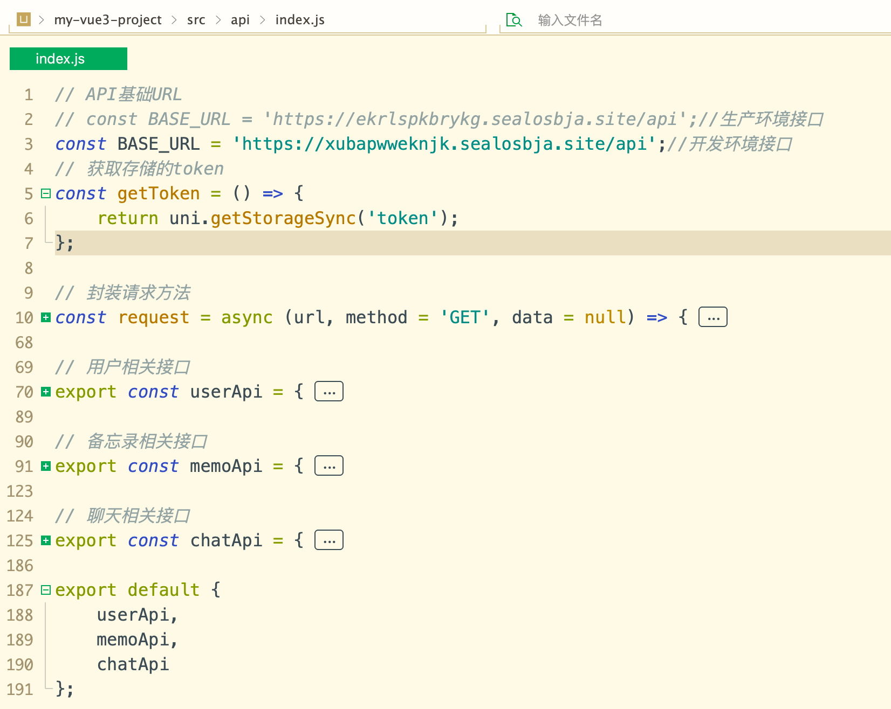

# API 接口文档

## 基本信息

- **基础 URL**: `https://xubapwweknjk.sealosbja.site/api`
- **认证方式**: Bearer Token (JWT)
- **请求格式**: application/json
- **响应格式**: application/json

## 认证

所有需要认证的接口都需要在请求头中包含 JWT Token：

```
Authorization: Bearer <YOUR_JWT_TOKEN>
```

## 功能文档一览表

实现的功能具体如下：

| 分类   |      |            |                               |            |            |
| ------ | ---- | ---------- | ----------------------------- | ---------- | ---------- |
| 用户   | 登陆 | 注册       |                               |            |            |
| 备忘录 |      | 创建备忘录 | 查看备忘录列表/查看指定备忘录 | 修改备忘录 | 删除备忘录 |
| chat   |      | 新建会话   | 会话列表/详情-继续会话        |            | 删除会话   |



## 用户相关接口 /user

### 1. 用户注册

- **URL**: `/api/user/register`
- **Method**: `POST`
- **Headers**: `Content-Type: application/json`
- **Body**:

```json
{
  "username": "string",
  "password": "string",
  "confirmPassword": "string" //长度必须六位以上
}
```

- **Success Response (200 OK)**:

```json
{
  "code": 200,
  "data": {
    "id": "string",
    "username": "string",
    "createTime": "2023-10-27T10:00:00.000Z"
  },
  "message": "注册成功"
}
```

- **Error Response (400 Bad Request)**:

```json
{
  "code": 400,
  "message": "用户名已存在"
}
```

### 2. 用户登录

- **URL**: `/api/user/login`
- **Method**: `POST`
- **Headers**: `Content-Type: application/json`
- **Body**:

```json
{
  "username": "string",
  "password": "string",
  "remember": false
}
```

- **Success Response (200 OK)**:

```json
{
  "code": 200,
  "data": {
    "token": "string",
    "user": {
      "id": "string",
      "username": "string"
    }
  },
  "message": "登录成功"
}
```

- **Error Response (401 Unauthorized)**:

```json
{
  "code": 401,
  "message": "用户名或密码错误"
}
```

## 备忘录相关接口

### 1. 获取备忘录列表

- **URL**: `/api/memo/list`
- **Method**: `GET`
- **Headers**: `Authorization: Bearer <token>`
- **Query Parameters**:

  - `page` (number): 页码，默认 1
  - `pageSize` (number): 每页数量，默认 10

- **Success Response (200 OK)**:

```json
{
  "code": 200,
  "data": {
    "list": [
      {
        "id": "string",
        "title": "string",
        "content": "string",
        "createTime": "2023-10-27T10:00:00.000Z",
        "updateTime": "2023-10-27T10:00:00.000Z"
      }
    ],
    "total": 100,
    "page": 1,
    "pageSize": 10
  },
  "message": "获取成功"
}
```

### 2. 获取备忘录详情

- **URL**: `/api/memo/detail/:id`
- **Method**: `GET`
- **Headers**: `Authorization: Bearer <token>`
- **Success Response (200 OK)**:

```json
{
  "code": 200,
  "data": {
    "id": "string",
    "title": "string",
    "content": "string",
    "createTime": "2023-10-27T10:00:00.000Z",
    "updateTime": "2023-10-27T10:00:00.000Z"
  },
  "message": "获取成功"
}
```

### 3. 创建备忘录

- **URL**: `/api/memo/create`
- **Method**: `POST`
- **Headers**:
  - `Content-Type: application/json`
  - `Authorization: Bearer <token>`
- **Body**:

```json
{
  "title": "string",
  "content": "string"
}
```

- **Success Response (201 Created)**:

```json
{
  "code": 201,
  "data": {
    "id": "string",
    "title": "string",
    "content": "string",
    "createTime": "2023-10-27T10:00:00.000Z",
    "updateTime": "2023-10-27T10:00:00.000Z"
  },
  "message": "创建成功"
}
```

### 4. 更新备忘录

- **URL**: `/api/memo/update/:id`
- **Method**: `PUT`
- **Headers**:
  - `Content-Type: application/json`
  - `Authorization: Bearer <token>`
- **Body**:

```json
{
  "title": "string",
  "content": "string"
}
```

- **Success Response (200 OK)**:

```json
{
  "code": 200,
  "data": {
    "id": "string",
    "title": "string",
    "content": "string",
    "updateTime": "2023-10-27T10:00:00.000Z"
  },
  "message": "更新成功"
}
```

### 5. 删除备忘录

- **URL**: `/api/memo/delete/:id`
- **Method**: `DELETE`
- **Headers**: `Authorization: Bearer <token>`
- **Success Response (200 OK)**:

```json
{
  "code": 200,
  "message": "删除成功"
}
```

---

## AI 聊天相关接口

#### 前端实现的功能：做一个会话交互功能，后端调用星火 API 接口进行存储。为了保证上下文，需要将历史信息都发送给后端，由后端进行统一处理发送给星火接口。

#### 如果选中历史会话，继续会话的时候 需要拿到所有的历史会话，携带着当前最新的用户 props。

### 1. 发送消息（创建或继续会话）

- **URL**: `/api/chat`
- **Method**: `POST`
- **Headers**:
  - `Content-Type: application/json`
  - `Authorization: Bearer <token>`
- **Body**:

```json
{
  "messages": [
    {
      "role": "user",
      "content": "你好，AI！"
    }
  ],
  "model": "x1",
  "sessionId": "60c72b2f9b1d8c001f8e4a3c"
}
```

**参数说明**:

- `messages` (array): 消息数组，包含对话历史
- `model` (string, 可选): AI 模型，默认为 'x1'
- `sessionId` (string, 可选): 会话 ID，用于继续现有对话
- **Success Response (200 OK)**:

```json
{
  "choices": [
    {
      "message": {
        "role": "assistant",
        "content": "你好！有什么可以帮助你的吗？"
      }
    }
  ],
  "sessionId": "60c72b2f9b1d8c001f8e4a3c"
}
```

- **Error Response (400 Bad Request)**:

```json
{
  "error": "messages 不能为空且必须为数组"
}
```

### 2. 获取聊天会话列表

- **URL**: `/api/chat/sessions`
- **Method**: `GET`
- **Headers**: `Authorization: Bearer <token>`
- **Success Response (200 OK)**:

```json
[
  {
    "_id": "60c72b2f9b1d8c001f8e4a3c",
    "title": "关于Vue3的问题",
    "user": "60c72b1a9b1d8c001f8e4a3b",
    "createTime": "2023-10-27T10:00:00.000Z",
    "updateTime": "2023-10-27T10:05:00.000Z"
  },
  {
    "_id": "60c72b3a9b1d8c001f8e4a3d",
    "title": "项目开发讨论",
    "user": "60c72b1a9b1d8c001f8e4a3b",
    "createTime": "2023-10-26T15:30:00.000Z",
    "updateTime": "2023-10-26T16:00:00.000Z"
  }
]
```

### 3. 获取单个会话详情

- **URL**: `/api/chat/sessions/:id`
- **Method**: `GET`
- **Headers**: `Authorization: Bearer <token>`
- **Success Response (200 OK)**:

```json
{
  "_id": "60c72b2f9b1d8c001f8e4a3c",
  "title": "关于Vue3的问题",
  "user": "60c72b1a9b1d8c001f8e4a3b",
  "messages": [
    {
      "role": "user",
      "content": "Vue3有什么新特性？"
    },
    {
      "role": "assistant",
      "content": "Vue3引入了Composition API、Teleport和Fragments等新特性。"
    }
  ],
  "createTime": "2023-10-27T10:00:00.000Z",
  "updateTime": "2023-10-27T10:05:00.000Z"
}
```

- **Error Response (404 Not Found)**:

```json
{
  "message": "Session not found"
}
```

### 4. 更新会话标题

- **URL**: `/api/chat/sessions/:id`
- **Method**: `PUT`
- **Headers**:
  - `Content-Type: application/json`
  - `Authorization: Bearer <token>`
- **Body**:

```json
{
  "title": "Vue3核心问题"
}
```

- **Success Response (200 OK)**:

```json
{
  "_id": "60c72b2f9b1d8c001f8e4a3c",
  "title": "Vue3核心问题",
  "user": "60c72b1a9b1d8c001f8e4a3b",
  "updateTime": "2023-10-27T10:05:00.000Z"
}
```

### 5. 删除会话

- **URL**: `/api/chat/sessions/:id`
- **Method**: `DELETE`
- **Headers**: `Authorization: Bearer <token>`
- **Success Response (200 OK)**:

```json
{
  "message": "Session deleted successfully"
}
```

- **Error Response (404 Not Found)**:

```json
{
  "message": "Session not found"
}
```

---

## 错误码说明

| 错误码 | 说明             |
| ------ | ---------------- |
| 200    | 请求成功         |
| 201    | 创建成功         |
| 400    | 请求参数错误     |
| 401    | 未授权，需要登录 |
| 403    | 禁止访问         |
| 404    | 资源不存在       |
| 500    | 服务器内部错误   |

### 注意事项

1. **认证要求**: 除了注册和登录接口，其他所有接口都需要在请求头中包含有效的 JWT Token
2. **错误处理**: 所有接口都可能返回错误
3. **数据格式**: 请求和响应都使用 JSON 格式
4. **会话管理**: AI 聊天功能支持会话管理，可以继续之前的对话
5. **分页**: 备忘录列表接口支持分页查询
6. **实时性**: 聊天接口基于讯飞星火大模型，响应时间取决于网络和模型处理速度（较慢，免费版）
